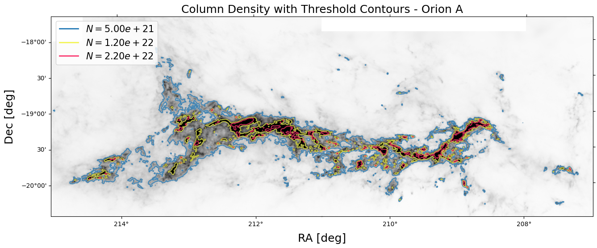
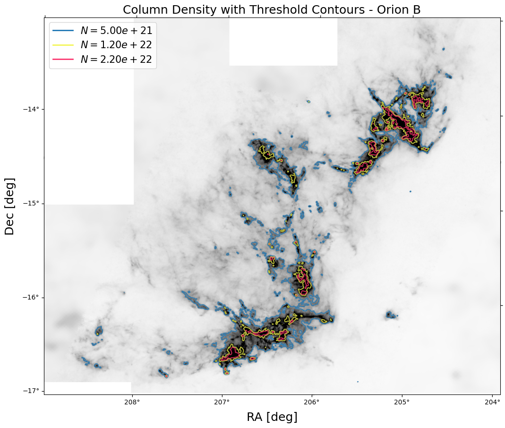
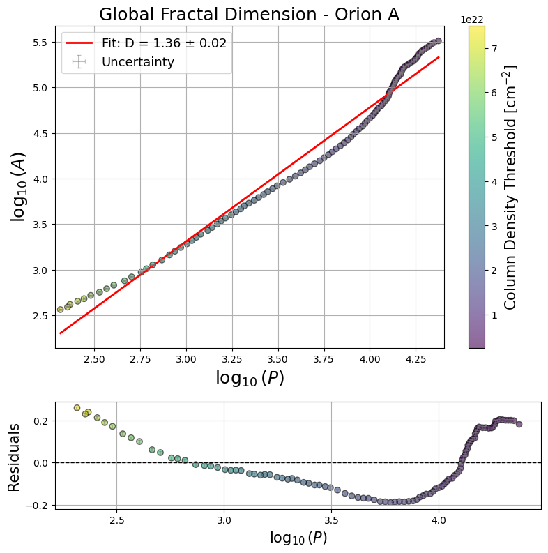
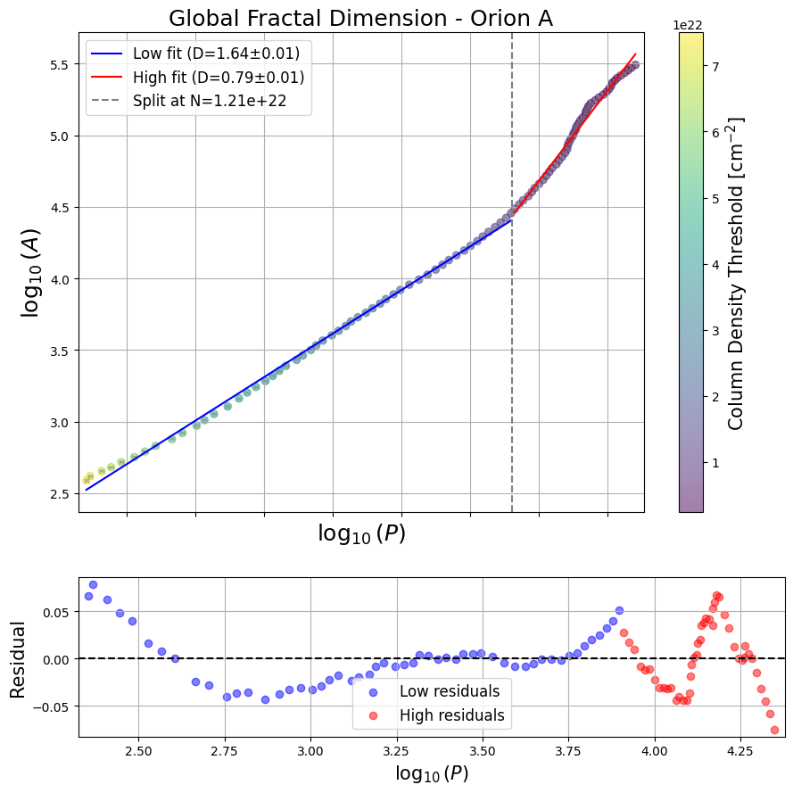
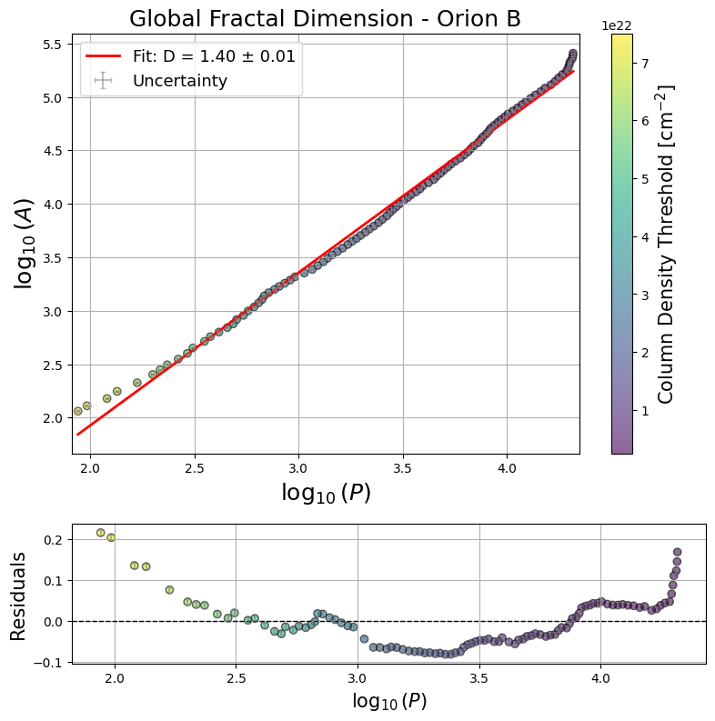
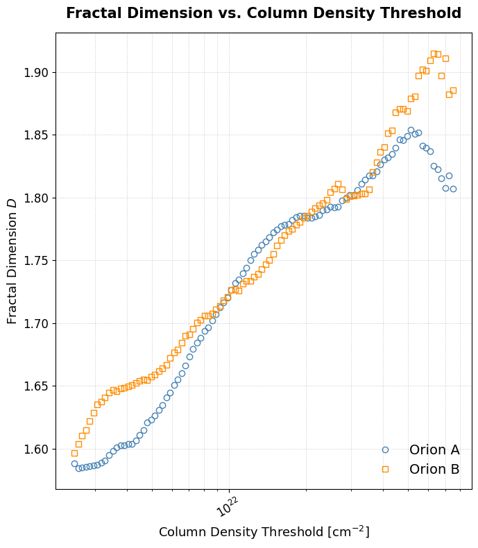
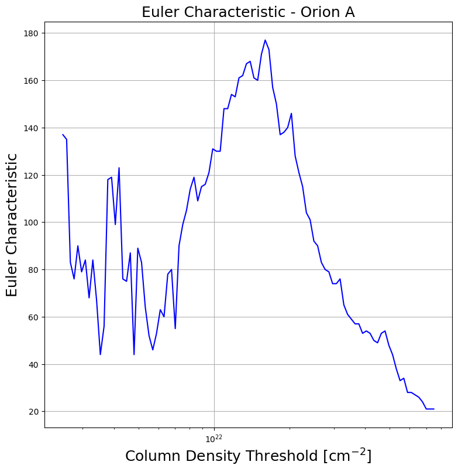
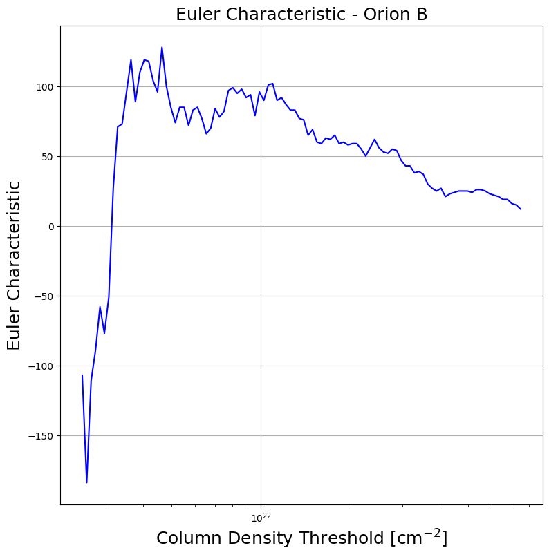

# Report_01

Date: 2026-06-19

These first few weeks have been spent salvaging the code from the previous repository, reorganizing my thoughts and reviewing the main results we presented in the Master's thesis. 

**Pre-processing of dust emission maps**
- This include the conversion from dust optical depth $\tau$ (353 GHz) to column density and mass maps, as well as removing regions of lower resolution from Planck data.

## Pre-processed maps with some characteristic thresholds
A couple pictures to visualize how the shapes change with increasing column density thresholds. Here only three are shown one low, one transitional (onset of active star formation and the emergence of dense cores), and one high.

## Global Fractal Dimension 
How is it calculated

For Orion A, a double fit is required, indicating a change in the underlying physics. The double fit can be seen in Figure 5.2. This transition occurs at a column density of N = 1.23 × 1022 cm−2, marking a physically significant scale. At this threshold, the structural properties of Orion A shift, coinciding with the onset of active star formation and the emergence of dense cores [ LLA10]. The concurrent changes in fractal dimension and topology at this scale suggest a direct link between the cloud’s morphology and the physical processes driving star formation. Without applying the double fit, the global fractal dimension is D = 1.35 ± 0.01. The single fit for Orion A can be seen in Figure 5.1. This value is in good agreement with previously reported fractal dimensions for molecular clouds derived with alternative methods [EF96 ], where typical values are around D ∼ 1.3. Numerical simulations based on two-dimensional compressible turbulence in a self-gravitating ISM also reproduce similar values [ YZWS94]. Note that many studies report the three-dimensional fractal dimension, which is related to the two-dimensional value by adding unity. When the data are separated into two regimes, we obtain D = 1.65 ± 0.01 at higher column densities and D = 0.97 ± 0.03 at lower column densities. Although a fractal dimension smaller than 1 is not expected in theory, this result is likely influenced by the limited number of data points contributing to the low -density fit. Even so, the trend is informative: a fractal dimension approaching 1 indicates smoother, simpler boundaries, whereas higher column densities exhibit more complex, space-filling structures.

This visual progression confirms the double trend inferred from the global analysis. Below the transition, the cloud exhibits more complex, interconnected structures, cor- responding to the higher global fractal dimension (D = 1.65). Above the transition, the morphology is dominated by simpler, more isolated cores, reflected in the lower fitted fractal dimension (D ≈ 1).

In Orion B, by contrast, no such break is required. This outcome is broadly consistent with expectations, as Orion B is known to be a more turbulent molecular cloud [ OPG+17]. In such an environment, scale-free behavior dominates across the column -density range analyzed, as reflected in the high quality of the single global fractal dimension fit (Figure 5.3). The emergence of cores does not appear to disrupt the hierarchical structuring. Together, these findings provide the first elements of a coherent picture described by the Minkowski functionals.

As with Orion A, it is important to verify whether the conclusions drawn for Orion B are consistent with its visual appearance. In the corresponding gallery (Figure B.2), Orion B breaks down into smaller components relatively quickly, yet the overall visual complexity remains comparable across the examined thresholds. The structures appear to fragment in a gradual and continuous manner, with each region breaking into substructures at similar rates. Because this fragmentation proceeds smoothly across the entire column -density range, there is no clear transition point that would require separating the perimeter–area relation into distinct regimes. The morphology gives the impression of a consistent, scale-free process, with no abrupt change in structural organization. This visual assessment therefore supports the quantitative findings: a single global fractal dimension is sufficient to describe Orion B, consistent with a more turbulent environment in which fragmentation occurs in a self-similar way.

## Local Fractal Dimension
The local fractal dimension builds on the perimeter–area relation, but in this case the relation is inverted to obtain a proxy for the boundary complexity of individual structures. This measure offers a more nuanced view than the global approach, capturing how structural complexity evolves with column density on a local scale. The local fractal dimension calculated at each column-density threshold shows a consistent trend toward D(ν) ≈ 2 at higher thresholds for both Orion A and Orion B (Figure 5.6). This behavior appears to arise not from the increasing complexity of individual structures, but rather from the growing, interconnected network of cores, fibers, and filaments that emerge as the cloud fragments at higher column densities. The average local fractal dimension for both Orion A and Orion B is approximately 1.7, which remains within the expected range for molecular clouds. This value suggests that, on average, the boundaries of structures in both regions are moderately complex—more intricate than simple geometric shapes, but not fully space-filling. Such averages are consistent with previous studies and support the interpretation that turbulence and hierarchical fragmentation are key drivers of cloud morphology at these scales.

## Genus / Euler Number

Moreover, the Euler characteristic highlights clear differences between Orion A and Orion B. Orion A exhibits a profile that closely resembles the behavior expected from Gaussian Random Field simulations, with a well-defined peak at approximately 1.64 × 44 1022 cm−2. For comparison, the results for a GRF are included in the Appendix in Figure A.9. This threshold is significant, echoing the transition seen in the global fractal dimension analysis, and marks the emergence of dense cores within the cloud. In contrast, Orion B shows no such pronounced peak, instead displaying a more gradual, almost linear decrease. If Orion B is indeed more strongly influenced by turbulence, this behavior is consistent with a more scale-free, less clustered structure, where the appearance of dense cores is more gradual and widely distributed. The topological analysis therefore reinforces the notion that turbulence governs the structural evolution of Orion B, while Orion A undergoes distinct transitions closely tied to star-formation thresholds.

In Orion A, the sharp peak in the Euler characteristic corresponds to a rapid transition from a regime dominated by isolated structures to one in which these structures merge into a more interconnected network. The example cutouts in Figure 6.2 highlight this process as well: at low column densities, the cloud consists of one big connected structure surrounded by many disconnected regions; at mid range that starts to change, whereas at higher thresholds these regions coalesce into larger, more complex entities. This marks the transition from a regime of many disconnected structures to one where connectivity increases rapidly. In contrast, Figure 6.3 for Orion B shows a more gradual evolution. Here, the Euler characteristic decreases smoothly, indicating that fragmentation and merging occur over a broader range of column densities. The visual examples confirm that Orion B maintains a predominantly filamentary and interconnected morphology across scales, consistent with its interpretation as a more turbulent, scale-free environment

Taken together, our analysis provides a cohesive view of the structural and phys- ical differences between Orion A and Orion B. The combination of global and local fractal dimension measurements, topological diagnostics through the Euler characteristic, and the hierarchical insights from the MSD analysis reveals that both clouds exhibit scale-dependent behavior, but in distinct ways. Orion A shows clear structural trans- itions—evident in the change of slope in the global perimeter–area relation and the sharp features in the Euler characteristic—marking the emergence of dense cores and a close connection between increasing morphological complexity and active star formation. In contrast, Orion B maintains a more uniform, filamentary character and exhibits weaker correlations with local complexity, consistent with a more turbulent, scale -free environment where star formation proceeds in a more distributed manner.

## Discussion
Draft Paper (what is the main point?)

Some questions: 
- which simulations would you consider working for the next step?
- which other data?

Next Steps
- Review Validity, Error Bars, and Interpretation
- Sims/other data
- 

